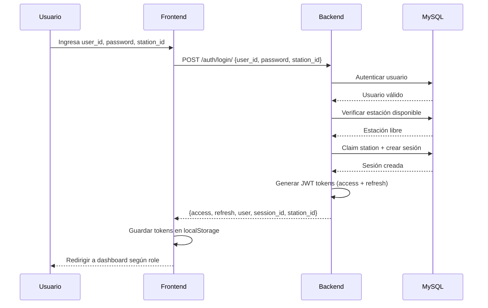

# Guía de Integración Frontend-Backend - Daily Log 2.0

## ✅ Cambios Implementados

### 1. **Cliente API Base** (`lib/api/client.ts`)
- Cliente HTTP con soporte para autenticación JWT
- Auto-refresh de tokens cuando expiran
- Manejo de errores centralizado
- Configuración de headers automática

### 2. **Gestión de Tokens JWT** (`lib/auth/tokens.ts`)
- Decodificación de tokens JWT
- Verificación de expiración
- Almacenamiento en localStorage
- Funciones de utilidad para manejo de tokens

### 3. **Tipos TypeScript Actualizados** (`features/auth/types.ts`)
**Antes (Mock):**
```typescript
interface User {
  username: string;
  role: UserRole;
  displayName: string;
}

interface LoginCredentials {
  username: string;
  password: string;
}
```

**Ahora (Backend API):**
```typescript
interface User {
  id: number;
  name: string;
  role: string; // "operador", "supervisor", etc.
  role_id: number;
  session?: SessionInfo | null;
}

interface LoginCredentials {
  user_id: number;     // ID de usuario de la BD
  password: string;
  station_id: number;  // ID de estación a reclamar
}
```

### 4. **API de Autenticación** (`features/auth/api.ts`)
- **`loginUser(credentials)`** - POST `/api/v1/auth/login/`
- **`logoutUser()`** - POST `/api/v1/auth/logout/`  
- **`getCurrentUser()`** - GET `/api/v1/auth/me/`

### 5. **Componente Login Actualizado**
Nuevos campos:
- **User ID** (number) - Reemplaza username
- **Password** (string)
- **Station ID** (number) - Nuevo campo obligatorio

### 6. **App.tsx Actualizado**
- Logout async conectado con API
- Routing basado en role del backend
- Import de `logoutUser` de la API

---

## 🚀 Cómo Probar la Integración

### Paso 1: Iniciar el Backend (Django)

```bash
cd daily-log-backend

# Activar entorno virtual (si aplica)
# python -m venv venv
# .\venv\Scripts\activate

# Instalar dependencias
pip install -r requirements/development.txt

# Aplicar migraciones
python manage.py migrate

# Iniciar servidor
python manage.py runserver
```

El backend debe estar corriendo en: **http://localhost:8000**

### Paso 2: Verificar Configuración del Backend

**Archivo:** `daily-log-backend/.env`
```env
# Django
SECRET_KEY=django-insecure-CHANGE-THIS-IN-PRODUCTION
DEBUG=True
ALLOWED_HOSTS=localhost,127.0.0.1

# Database (MySQL remoto)
DB_NAME=sig_dailylogs
DB_USER=sig_dailylogs_db_user
DB_PASSWORD=W3#zCQ8OQeHU
DB_HOST=72.167.56.142
DB_PORT=3306

# JWT
JWT_ACCESS_TOKEN_LIFETIME_MINUTES=60
JWT_REFRESH_TOKEN_LIFETIME_DAYS=7

# CORS - Permite requests del frontend
CORS_ALLOWED_ORIGINS=http://localhost:3000,http://localhost:5173
```

### Paso 3: Iniciar el Frontend (React + Vite)

```bash
cd daily-log-frontend/react-ts

# Instalar dependencias
npm install

# Verificar archivo .env
```

**Archivo:** `daily-log-frontend/react-ts/.env`
```env
VITE_API_URL=http://localhost:8000/api/v1
```

```bash
# Iniciar servidor de desarrollo
npm run dev
```

El frontend debe estar corriendo en: **http://localhost:5173**

---

## 🧪 Credenciales de Prueba

Para probar el login, necesitas:

1. **User ID** - El `ID_user` de la tabla `daily_users` en MySQL
2. **Password** - La contraseña del usuario en la BD
3. **Station ID** - El `ID_station` de la tabla `daily_stations_info`

### Ejemplo de Login

```
User ID: 42 (ejemplo - buscar en la BD)
Password: tu_password
Station ID: 1 (ejemplo - buscar en la BD)
```

### Verificar Usuarios Disponibles en MySQL

```sql
-- Ver usuarios disponibles
SELECT ID_user, user_name FROM daily_users;

-- Ver estaciones disponibles
SELECT ID_station, station_number FROM daily_stations_info;

-- Ver roles para mapping
SELECT * FROM daily_roles;
```

---

## 🔍 Endpoints del Backend Disponibles

### Autenticación
- **POST** `/api/v1/auth/login/` - Login y obtener JWT tokens
- **POST** `/api/v1/auth/logout/` - Cerrar sesión (requiere auth)
- **POST** `/api/v1/auth/token/refresh/` - Refrescar access token
- **GET** `/api/v1/auth/me/` - Obtener perfil del usuario (requiere auth)
- **PATCH** `/api/v1/auth/me/status/` - Actualizar status (requiere auth)

### Documentación API
- **Swagger UI**: http://localhost:8000/api/docs/
- **Schema**: http://localhost:8000/api/schema/

---

## 🔧 Troubleshooting

### Error: "Network error occurred"
**Causa:** Backend no está corriendo o puerto incorrecto  
**Solución:** Verificar que Django esté en http://localhost:8000

### Error: "CORS policy blocked"
**Causa:** Frontend no está en la lista de CORS_ALLOWED_ORIGINS  
**Solución:** Agregar `http://localhost:5173` al .env del backend

### Error: "Invalid credentials"
**Causa:** User ID, password o station ID incorrectos  
**Solución:** Verificar datos en la base de datos MySQL

### Error: "Station already occupied"
**Causa:** La estación ya está asignada a otro usuario  
**Solución:** Usar otra estación o liberar la estación en `daily_stations_map`

### Error: "Session expired"
**Causa:** Access token expiró y refresh token también  
**Solución:** Hacer login nuevamente

---

## 📋 Flujo de Autenticación



---

## ✨ Próximos Pasos (Opcional)

1. **Selector de Estaciones Dinámico**
   - Crear endpoint GET `/api/v1/stations/` para listar estaciones disponibles
   - Reemplazar input numérico con dropdown

2. **Persistencia de Sesión**
   - Agregar auto-login al refrescar la página
   - Verificar token válido en `useEffect` del App.tsx

3. **Manejo de Errores Mejorado**
   - Mensajes de error específicos por tipo
   - Toast notifications para feedback

4. **LDAP Integration**
   - Implementar autenticación contra LDAP corporativo
   - Mantener fallback a BD local

---

## 📚 Archivos Modificados

### Frontend
- ✅ `src/lib/api/client.ts` (nuevo)
- ✅ `src/lib/auth/tokens.ts` (nuevo)
- ✅ `src/features/auth/types.ts` (actualizado)
- ✅ `src/features/auth/api.ts` (actualizado)
- ✅ `src/features/auth/pages/Login.tsx` (actualizado)
- ✅ `src/App.tsx` (actualizado)
- ✅ `.env` (nuevo)

### Backend (sin cambios - ya estaba listo)
- ✅ `apps/users/views.py`
- ✅ `apps/users/serializers.py`
- ✅ `apps/users/services.py`
- ✅ `config/settings/base.py`
- ✅ `.env`

---

## 🎯 Estado del Proyecto

| Componente | Estado |
|------------|--------|
| Backend API | ✅ Funcionando |
| JWT Authentication | ✅ Implementado |
| CORS Configuration | ✅ Configurado |
| Frontend API Client | ✅ Implementado |
| Token Management | ✅ Auto-refresh |
| Login Component | ✅ Conectado |
| Type Safety | ✅ TypeScript strict |
| Error Handling | ✅ Centralizado |
